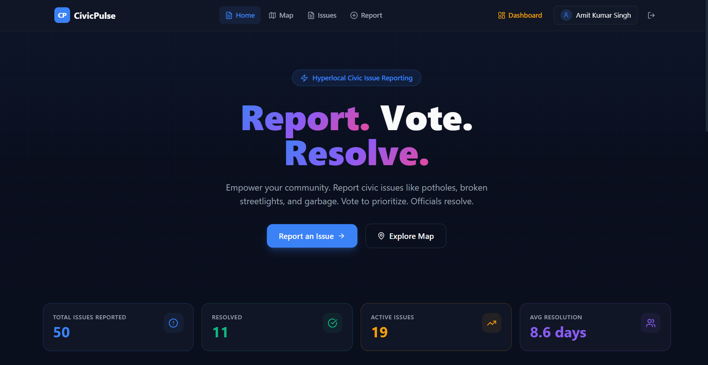
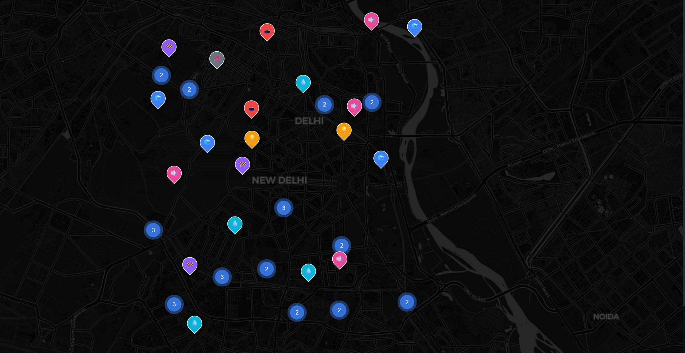
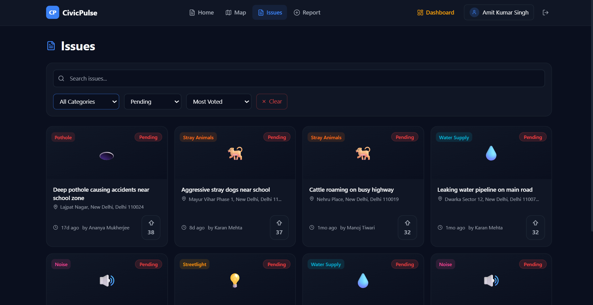
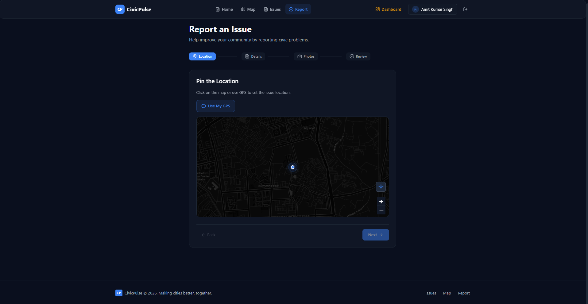
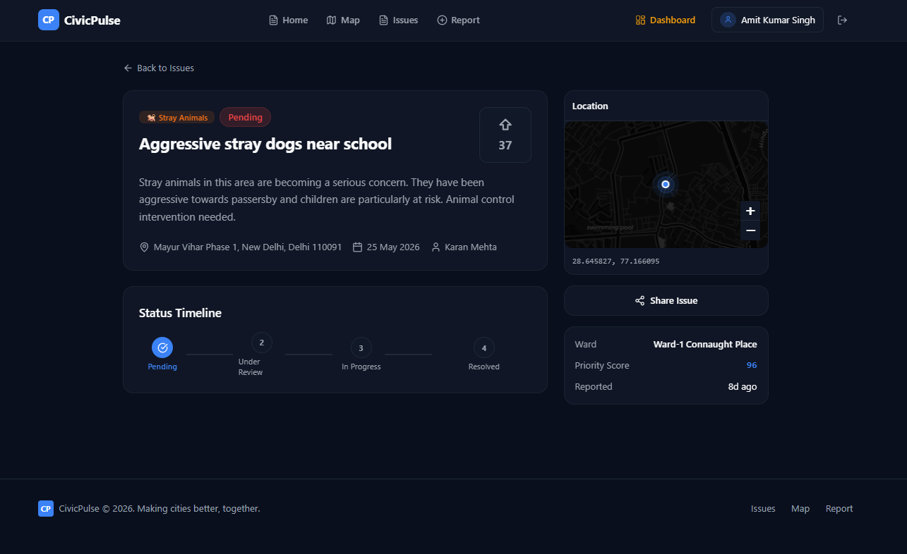
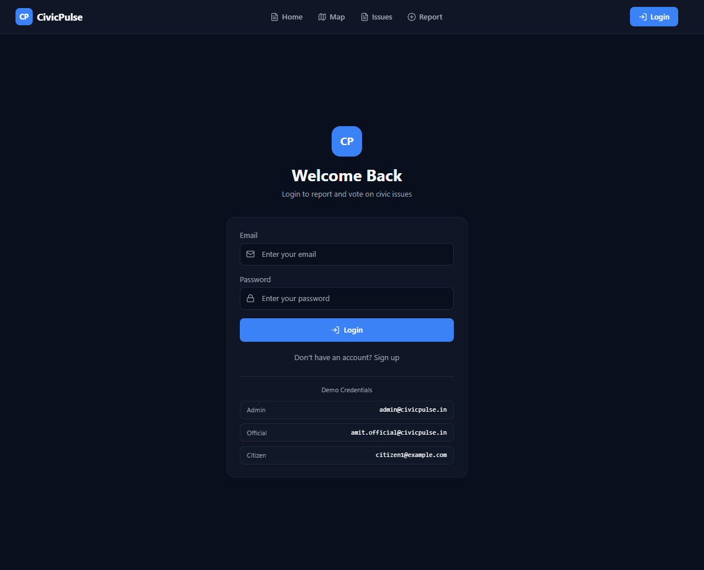
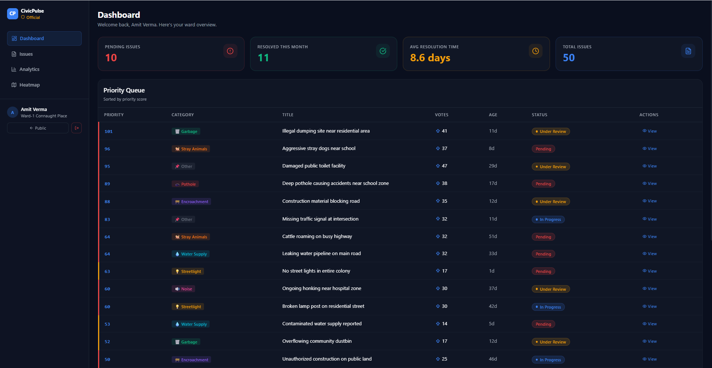
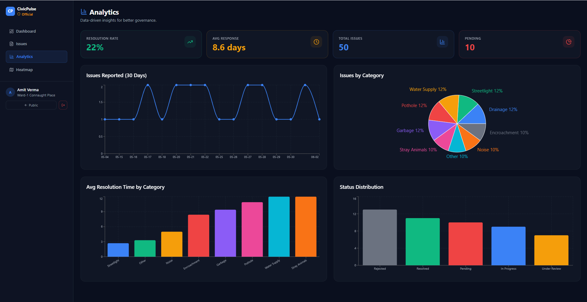
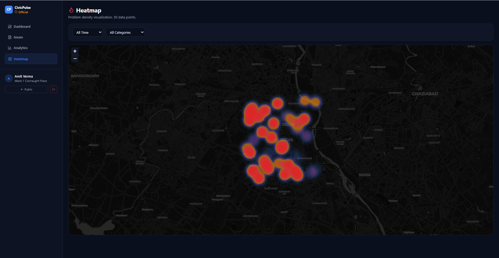
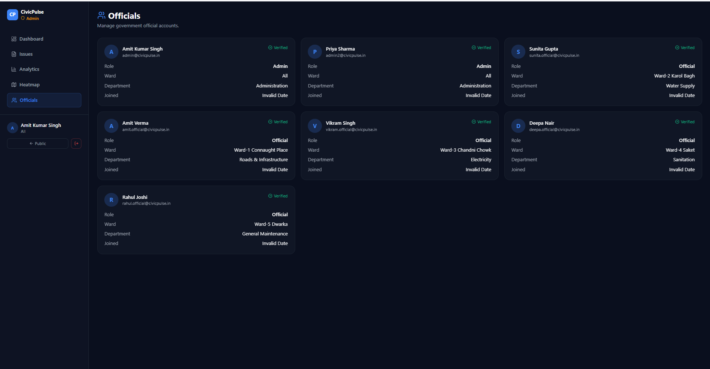

<div align="center">

# 🏛️ CivicPulse

### **Report. Vote. Resolve.**

*Empowering citizens to build better cities — one report at a time.*

[](https://nextjs.org/)
[](https://expressjs.com/)
[](https://www.mongodb.com/)
[](https://www.typescriptlang.org/)
[](https://leafletjs.com/)
[](https://cloudinary.com/)

<br/>

**CivicPulse** is a hyperlocal civic issue reporting platform where citizens can report problems like potholes, broken streetlights, and garbage — then vote to prioritize them. Government officials manage everything through a dedicated real-time dashboard.

<br/>

[🚀 Live Demo](#) · [📖 API Docs](#-api-documentation) · [🐛 Report Bug](https://github.com/your-repo/issues) · [✨ Request Feature](https://github.com/your-repo/issues)

</div>

---

## 📸 Screenshots

<div align="center">

### 🌐 Public Portal (Citizens)

<table>
  <tr>
    <td width="50%">
      
      <p align="center"><b>🏠 Home Page</b><br/><sub>Landing page with live stats & gradient hero</sub></p>
    </td>
    <td width="50%">
      
      <p align="center"><b>🗺️ Interactive Map</b><br/><sub>Clustered markers with GPS location & filters</sub></p>
    </td>
  </tr>
  <tr>
    <td width="50%">
      
      <p align="center"><b>📋 Issues List</b><br/><sub>Filterable card grid with voting & status badges</sub></p>
    </td>
    <td width="50%">
      
      <p align="center"><b>📝 Report Issue</b><br/><sub>Multi-step form with map pin & photo upload</sub></p>
    </td>
  </tr>
  <tr>
    <td width="50%">
      
      <p align="center"><b>🔍 Issue Detail</b><br/><sub>Status timeline, comments & photo gallery</sub></p>
    </td>
    <td width="50%">
      
      <p align="center"><b>🔐 Login Page</b><br/><sub>Role-based authentication portal</sub></p>
    </td>
  </tr>
</table>

### 🏛️ Official Dashboard (Government)

<table>
  <tr>
    <td width="50%">
      
      <p align="center"><b>📊 Dashboard Overview</b><br/><sub>Stats grid with priority queue & quick actions</sub></p>
    </td>
    <td width="50%">
      
      <p align="center"><b>📈 Analytics</b><br/><sub>Line charts, pie charts & trend analysis</sub></p>
    </td>
  </tr>
  <tr>
    <td width="50%">
      
      <p align="center"><b>🔥 Heatmap</b><br/><sub>Problem density visualization by category</sub></p>
    </td>
    <td width="50%">
      
      <p align="center"><b>👥 Team Management</b><br/><sub>Admin-only official account management</sub></p>
    </td>
  </tr>
</table>

</div>

> **💡 Tip:** Place your screenshots in a `screenshots/` folder at the project root. Use filenames matching those above.

---

## ✨ Key Features

<table>
  <tr>
    <td>

### 🌐 Public Portal (Citizens)
- 🗺️ **Interactive Map** — Leaflet map with clustered markers, colored by category
- 📝 **Report Issues** — Multi-step form with GPS, map pin & photo upload
- 🗳️ **Vote System** — Upvote to prioritize with optimistic UI
- 🔍 **Issue Tracking** — Status timeline, official responses, galleries
- 🔎 **Filter & Search** — By category, status, ward, keywords
- 📍 **Find Near Me** — Browser geolocation for nearby issues

</td>
<td>

### 🏛️ Official Dashboard (Government)
- 📊 **Priority Queue** — Vote-based priority scoring
- ✅ **Status Management** — Update with comments & rejection reasons
- 👤 **Officer Assignment** — Assign to specific officials
- 📈 **Analytics** — Line, pie & bar charts for decisions
- 🔥 **Heatmap** — Problem density with time/category filters
- 👥 **Team Management** — Admin-only official management

</td>
  </tr>
</table>

---

## 🛠️ Tech Stack

<div align="center">

| Layer | Technology | Purpose |
|:---:|:---|:---|
| 🎨 **Frontend** | Next.js 14 (App Router), Tailwind CSS, Framer Motion | UI & Routing |
| 🗺️ **Maps** | Leaflet.js, OpenStreetMap, MarkerCluster, Heatmap | Geospatial Visualization |
| 📊 **Charts** | Recharts | Analytics & Data Viz |
| 📦 **State** | Zustand (persisted) | Global State Management |
| ⚙️ **Backend** | Express.js + TypeScript | REST API |
| 🗄️ **Database** | MongoDB + Mongoose (2dsphere indexes) | Data Storage |
| 🔐 **Auth** | JWT (access + refresh token rotation) | Authentication |
| 📷 **Storage** | Cloudinary (free tier) | Image Uploads |
| 🌍 **Geocoding** | Nominatim (OSM) | Reverse Geocoding |

</div>

---

## 🚀 Getting Started

### Prerequisites

```
Node.js 18+  ·  MongoDB (local or Atlas)  ·  Cloudinary account (free)
```

### 1️⃣ Clone & Install

```bash
git clone https://github.com/your-username/civicpulse.git
cd civicpulse

# Backend
cd backend && npm install

# Frontend
cd ../frontend && npm install
```

### 2️⃣ Environment Setup

<details>
<summary><b>📁 Backend — <code>backend/.env</code></b></summary>

```env
# Server
PORT=5000
NODE_ENV=development

# MongoDB Atlas
MONGODB_URI=mongodb+srv://<user>:<pass>@<cluster>.mongodb.net/civicpulse
# Optional alternate MongoDB URI specifically for CivicPulse data storage
MONGODB_URI_CIVICPULSE=
# Optional database name override if the URI does not include one
MONGODB_DB_NAME=

# JWT Secrets (generate with: node -e "console.log(require('crypto').randomBytes(32).toString('hex'))")
JWT_ACCESS_SECRET=your_access_secret_here
JWT_REFRESH_SECRET=your_refresh_secret_here
JWT_ACCESS_EXPIRY=15m
JWT_REFRESH_EXPIRY=7d

# Frontend URL (for CORS)
FRONTEND_URL=http://localhost:3000

# Cloudinary (free tier — cloudinary.com)
CLOUDINARY_CLOUD_NAME=your_cloud_name
CLOUDINARY_API_KEY=your_api_key
CLOUDINARY_API_SECRET=your_api_secret
```

</details>

<details>
<summary><b>📁 Frontend — <code>frontend/.env.local</code></b></summary>

```env
NEXT_PUBLIC_API_URL=http://localhost:5000
NEXT_PUBLIC_APP_NAME=CivicPulse
```

</details>

### 3️⃣ Seed Database

```bash
cd backend
npm run seed
```

> Creates **2 admins** · **5 officials** (different wards) · **20 citizens** · **50 sample issues** across Delhi NCR

### 4️⃣ Start Development Servers

```bash
# Terminal 1 — Backend (port 5000)
cd backend && npm run dev

# Terminal 2 — Frontend (port 3000)
cd frontend && npm run dev
```

<div align="center">

| Service | URL |
|:---:|:---:|
| 🌐 Frontend | http://localhost:3000 |
| ⚙️ Backend API | http://localhost:5000 |
| 💚 Health Check | http://localhost:5000/api/health |

</div>

### 5️⃣ Demo Credentials

<div align="center">

| Role | Email | Password |
|:---:|:---|:---:|
| 👑 **Admin** | `admin@civicpulse.in` | `admin123` |
| 🏛️ **Official** | `amit.official@civicpulse.in` | `official123` |
| 👤 **Citizen** | `citizen1@example.com` | `citizen123` |

</div>

---

## 📡 API Documentation

<details>
<summary><b>🔐 Auth Routes — <code>/api/auth</code></b></summary>

| Method | Endpoint | Auth | Description |
|:---:|:---|:---:|:---|
| `POST` | `/register` | ❌ | Citizen registration |
| `POST` | `/register-official` | 👑 | Official registration (admin only) |
| `POST` | `/login` | ❌ | Login → access + refresh tokens |
| `POST` | `/refresh` | ❌ | Refresh access token |
| `POST` | `/logout` | ✅ | Invalidate refresh token |
| `GET` | `/me` | ✅ | Get current user profile |

</details>

<details>
<summary><b>📋 Issue Routes — <code>/api/issues</code></b></summary>

| Method | Endpoint | Auth | Description |
|:---:|:---|:---:|:---|
| `GET` | `/` | ❌ | List issues (paginated, filterable) |
| `GET` | `/nearby?lat=&lng=&radius=` | ❌ | Geospatial nearby query |
| `GET` | `/priority?limit=` | ❌ | Top priority issues |
| `GET` | `/:id` | ❌ | Single issue details |
| `POST` | `/` | ✅ | Create issue |
| `PUT` | `/:id` | 🏛️ | Update issue (official) |
| `DELETE` | `/:id` | 👑 | Delete issue (admin) |
| `POST` | `/:id/vote` | ✅ | Toggle vote |

</details>

<details>
<summary><b>📷 Upload Routes — <code>/api/upload</code></b></summary>

| Method | Endpoint | Auth | Description |
|:---:|:---|:---:|:---|
| `POST` | `/image` | ✅ | Upload image to Cloudinary |
| `DELETE` | `/image/:publicId` | ✅ | Delete image from Cloudinary |

</details>

<details>
<summary><b>🏛️ Official Routes — <code>/api/official</code></b></summary>

| Method | Endpoint | Auth | Description |
|:---:|:---|:---:|:---|
| `GET` | `/issues` | 🏛️ | All issues (with ward/assignee filters) |
| `PUT` | `/issues/:id/status` | 🏛️ | Update issue status |
| `PUT` | `/issues/:id/assign` | 🏛️ | Assign to official |
| `GET` | `/team` | 👑 | List team members |

</details>

<details>
<summary><b>📊 Stats Routes — <code>/api/stats</code></b></summary>

| Method | Endpoint | Auth | Description |
|:---:|:---|:---:|:---|
| `GET` | `/overview` | ❌ | Summary metrics |
| `GET` | `/by-category` | ❌ | Grouped by category |
| `GET` | `/by-status` | ❌ | Grouped by status |
| `GET` | `/heatmap` | ❌ | Coordinates for heatmap layer |
| `GET` | `/trends` | ❌ | Daily counts (30 days) |
| `GET` | `/resolution-time` | ❌ | Avg resolution by category |

</details>

---

## 🚢 Deployment

<table>
<tr>
<td width="33%">

### 🔺 Frontend — Vercel
1. Push to GitHub
2. Import repo in [Vercel](https://vercel.com)
3. Set `NEXT_PUBLIC_API_URL`
4. Deploy ✅

</td>
<td width="33%">

### 🚂 Backend — Render
1. Push backend to GitHub
2. Create Web Service on [Render](https://render.com)
3. Build: `npm install && npm run build`
4. Start: `npm start`
5. Set all env variables

</td>
<td width="33%">

### 🍃 Database — Atlas
1. Create free M0 cluster at [mongodb.com](https://mongodb.com)
2. Get connection string
3. Set as `MONGODB_URI`

</td>
</tr>
</table>

---

## 📁 Project Structure

```
civicpulse/
│
├── 🌐 frontend/                    # Next.js 14 App
│   ├── app/
│   │   ├── (public)/               # Citizen-facing routes
│   │   │   ├── page.tsx            #   → Home
│   │   │   ├── map/                #   → Interactive Map
│   │   │   ├── issues/             #   → Issue List & Detail
│   │   │   ├── report/             #   → Report Form
│   │   │   └── login/              #   → Authentication
│   │   ├── (official)/             # Dashboard routes
│   │   │   └── dashboard/
│   │   │       ├── page.tsx        #   → Overview
│   │   │       ├── analytics/      #   → Charts & Trends
│   │   │       ├── heatmap/        #   → Problem Density
│   │   │       ├── issues/         #   → Issue Management
│   │   │       └── officials/      #   → Team Management
│   │   ├── globals.css             # Design system & themes
│   │   └── layout.tsx              # Root layout
│   ├── components/
│   │   ├── map/                    # Leaflet map components
│   │   ├── issues/                 # Issue cards, forms, filters
│   │   └── dashboard/              # Dashboard widgets
│   ├── lib/                        # API client, Zustand store, utils
│   └── types/                      # TypeScript interfaces
│
├── ⚙️ backend/                     # Express.js API
│   └── src/
│       ├── config/                 # DB + Cloudinary config
│       ├── models/                 # Mongoose schemas
│       ├── routes/                 # API route definitions
│       ├── controllers/            # Business logic
│       ├── middleware/             # Auth, roles, upload, rate limiting
│       ├── seed.ts                 # Database seeder
│       └── index.ts                # Server entry point
│
└── README.md
```

---

<div align="center">

## 🤝 Contributing

Contributions are welcome! Feel free to open an issue or submit a pull request.

1. Fork the project
2. Create your feature branch (`git checkout -b feature/amazing-feature`)
3. Commit your changes (`git commit -m 'Add amazing feature'`)
4. Push to the branch (`git push origin feature/amazing-feature`)
5. Open a Pull Request

---

## 📄 License

Distributed under the **MIT License**. See `LICENSE` for more information.

---

<br/>

**Built with ❤️ for better cities**

*If you found this project helpful, please consider giving it a ⭐*

<br/>

[](https://github.com/your-username/civicpulse)

</div>
